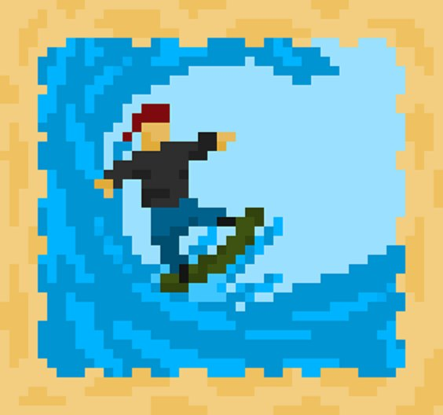
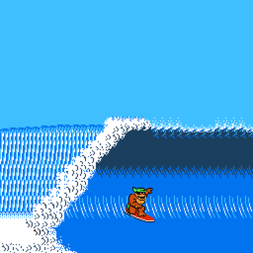
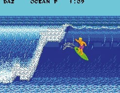

# Welcome to GitHub Pages

You can use the [editor on GitHub](https://github.com/Konnor-Filip/Learn2Surf/edit/gh-pages/index.md) to maintain and preview the content for your website in Markdown files.

Whenever you commit to this repository, GitHub Pages will run [Jekyll](https://jekyllrb.com/) to rebuild the pages in your site, from the content in your Markdown files.

## Example 1

Using images that link to modules in a page. Could have sections such as:

### Phishing

#### What is Phising?

*What is Phishing?*

*Learn to spot phishing*
#### How do you protect yourself?

## Exmaple 1 Continued

Using those images we can link to additional write ups, quizzes, activities, etc. How we want to go about those looking is up for consideration. Each might be different, which is something to consider as well. 

## Exmaple 2

Using long lists we can organize a table of contents and link to each module on the page. This is less clean, but we would have all of the information a student may want right on the page. Additionally, we can break this up with next and previous buttons similar to the service we use at UNO known as "Canvas"

- Bulleted
- List

1. Numbered
2. List

